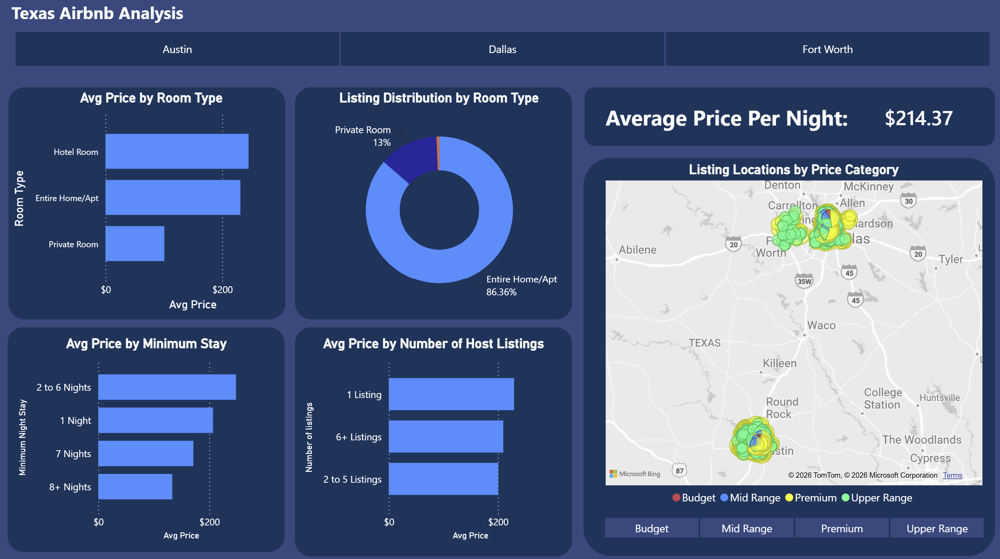
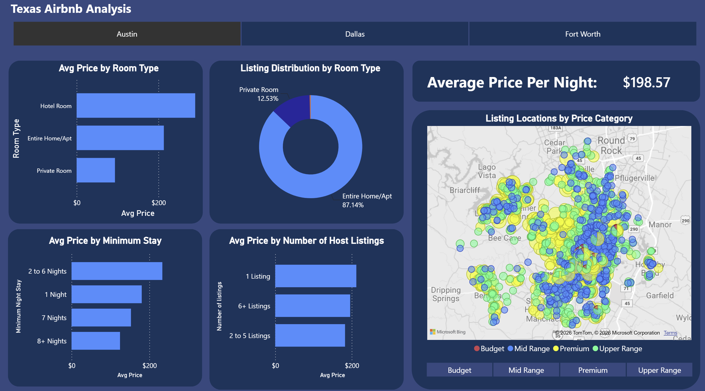
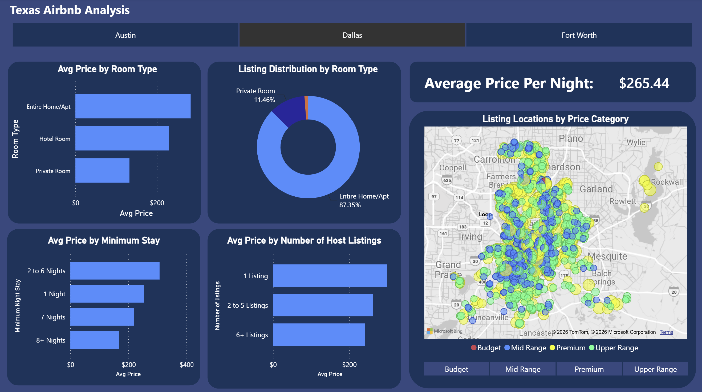
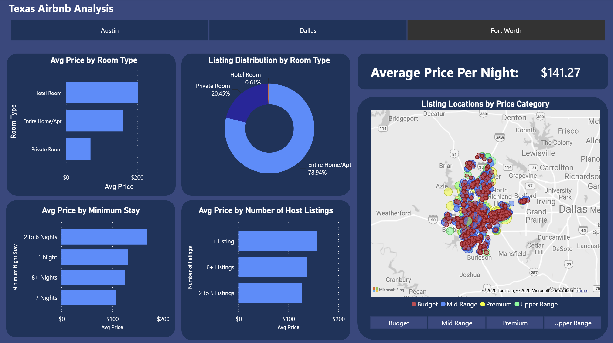

# Texas Airbnb Price Analysis

## Business Question

"What factors most influence Airbnb listing prices across major Texas cities, and how can hosts use these insights to price their properties competitively?”

## Tools Used

- **Python (pandas)** — data cleaning, null handling, outlier removal, and consolidating all three city datasets into one unified table
- **PostgreSQL** — hosted the cleaned dataset and ran the SQL analysis, using CTEs, window functions, and CASE WHEN logic to answer the business question
- **Power BI Desktop** — built an interactive dashboard with a city filter, price-tier filter, and a geographic map visual to communicate findings
- **VS Code (Jupyter Notebooks)** — used for EDA and the cleaning pipeline
- **pgAdmin 4** — used to manage the PostgreSQL database and run/test SQL queries
- **Git/GitHub** — version control and project hosting

## Project Structure

texas-airbnb-analysis/
├── notebooks/
│   ├── data_exploration.ipynb    # EDA across all 3 cities
│   └── cleaning.ipynb            # Data cleaning and consolidation
├── sql/
│   └── analysis.sql              # 10 SQL queries answering the business question
├── dashboard/
│   └── texas_airbnb_dashboard.pbix  # Power BI dashboard
├── README.md
└── .gitignore

## Data Source

https://insideairbnb.com/get-the-data/

## Key Findings

**City Pricing**
Dallas commands the highest average nightly price ($264), followed by Austin ($197) and Fort Worth ($141), the most affordable of the three markets.

**Room Type**
Entire homes/apartments dominate the market (79-87% of listings across all cities) and consistently outperform other room types in pricing power, except in Austin where hotel rooms ($289) edge out entire homes ($213).

**Location**
Austin contains the single most expensive area in Texas — zip code 78730 averages $510/night, nearly $200 more than Dallas's priciest district. Fort Worth has no neighbourhoods in the statewide top 10, confirming it as the most budget-friendly option for travelers and the least competitive market for premium listings.

**Minimum Stay Requirements**
Listings with a 2-6 night minimum command the highest nightly rate ($247), suggesting this is the sweet spot for traveler demand. Price steadily declines as minimum stay increases, indicating hosts trade nightly rate for booking stability on longer stays.

**Host Listing Count**
Hosts with only one listing charge the highest average price ($229), while hosts with 2-5 listings charge the least ($199). However the spread across all host types is narrow ($30), making this a weaker pricing factor than room type or location.

**Availability**
Listing availability does not meaningfully change with price — average days available stays consistent (230-270 days) across both budget and premium listings in every city.

## Dashboard Preview

*Findings above are drawn from the SQL analysis in `/sql/analysis.sql` and the interactive Power BI dashboard below. The dashboard includes a city filter and a price-tier filter on the map.*

*Default view — all three cities combined ($214.37 avg/night), showing listings concentrated in both the Dallas/Fort Worth metro and Austin.*

*Austin selected ($198.57 avg/night) — Premium and Upper Range listings are dense throughout central Austin, with very few Budget-tier (red) listings visible on the map.*

*Dallas selected ($265.44 avg/night) — the highest-priced city overall, with Hotel Rooms ($200+) priced close to Entire Home/Apt listings, and almost no Budget-tier listings.*

*Fort Worth selected ($141.27 avg/night) — the most affordable market, with a visibly higher share of Budget (red) and Mid Range (blue) listings compared to Austin and Dallas.*

## What Drives Pricing the Most

Based on the magnitude of price differences across this analysis, the factors ranked by influence are:

1. **City/Market:**  largest swings observed ($123 difference between Dallas and Fort Worth)
2. **Room Type:**  second largest driver, with entire homes commanding a significant premium over private/shared rooms in every city
3. **Location within city:**  Austin's premium zip codes command nearly double the city average
4. **Minimum stay requirement:**  moderate effect, with short-stay listings priced higher than long-stay
5. **Host listing count:**  weakest factor tested, only a $30 spread across all host types

## Untapped Market Opportunities

- **Fort Worth luxury segment:** Fort Worth has zero neighbourhoods in the statewide top 10 most expensive areas, and the fewest listings of all three cities. This signals minimal premium competition. A well-positioned, high-end listing could stand out significantly with little competing supply.
- **Fort Worth overall:** Smaller listing volume combined with high average availability (255 days) suggests the market is underserved relative to demand, presenting an opportunity for new hosts entering at any price point.
- **Dallas premium consistency:** Unlike Austin's concentrated luxury pockets, Dallas spreads its premium pricing across multiple districts fairly evenly. This suggests more flexibility for hosts choosing where to invest in a high-end Dallas property.
- **Budget tier scarcity in Austin/Dallas:** The dashboard map shows very few Budget-tier listings in Austin and Dallas compared to Fort Worth, where Budget and Mid Range listings make up the bulk of the market. This may reflect genuine demand-side pricing power in larger markets, or it could mean budget travelers are underserved in Austin/Dallas. Although it's also possible budget listings in high-cost markets aren't profitable enough for hosts to sustain, since fixed costs (mortgage, taxes, utilities) tend to scale with the local market regardless of nightly rate.

## Recommendations for Hosts

**For hosts with one property (side income / part-time)**
- You have more pricing power than hosts with multiple listings. Single-listing hosts charge the highest average price ($229) in this dataset. Don't underprice just because you're new. The data suggests solo hosts can command a premium.
- A 2-6 night minimum stay is the sweet spot for maximizing nightly rate while still attracting the largest pool of travelers.
- If your property is an entire home, lean into that. Entire homes consistently outperform private/shared rooms in nearly every city and price tier.

**For hosts treating this as a full-time business (multiple properties)**
- Hosts with 2-5 listings actually charge the least on average ($199) in this dataset, likely competing on volume rather than premium pricing. If you're scaling past one property, consider whether you're pricing competitively for volume or leaving margin on the table.
- Hosts with 6+ listings recover some pricing power ($207), suggesting a portfolio large enough to include higher-quality properties can offset the volume discount smaller multi-listing hosts take on.
- Location is one of the strongest levers available to you. Austin's premium zip codes justify nearly double the city average, and Dallas spreads premium pricing more evenly across districts. This means a full-time operator has more flexibility choosing where in Dallas to invest than in Austin, where luxury pricing is concentrated in a few areas.

**For hosts considering a new market**
- Fort Worth has no neighbourhoods in the statewide top 10 most expensive areas and the fewest total listings of the three cities. This signals an underserved luxury segment with limited competition for a well-positioned high-end property.
- Austin and Dallas show very few Budget-tier listings on the map relative to Fort Worth, which may indicate an opening for affordably priced properties in those markets. Although this could also reflect that budget pricing isn't sustainable there given higher fixed costs, so treat this as a hypothesis worth testing rather than a guarantee.

## Limitations

Although this analysis identifies several factors that influence Airbnb pricing in Texas, a few important limitations should be kept in mind:

- **No booking/occupancy data**: `availability_365` only shows how many days a listing is open for booking, not how many days it was actually booked. Conclusions about real demand (e.g. whether low availability signals high demand) would require `calendar.csv` data, which was not included in this analysis.
- **Review counts undercount actual bookings**: `number_of_reviews` was used as a proxy for booking activity, but not every guest leaves a review after their stay. This metric should be treated as a relative comparison between cities rather than an absolute measure of demand.
- **Inconsistent neighbourhood data across cities**: Austin identifies location by zip code, while Dallas and Fort Worth use district names. This made direct cross-city neighbourhood comparison unreliable, so neighbourhood-level findings were analyzed within each city separately.
- **Missing neighbourhood data in Fort Worth**: 956 listings (about 46% of Fort Worth's dataset) were missing neighbourhood values and were filled with "Unknown" rather than dropped, to avoid losing a large share of an already small dataset. Fort Worth neighbourhood-level findings should be interpreted with some caution as a result.
- **Single consolidated table**: All three cities were combined into one table during the cleaning stage, so the SQL analysis did not require JOIN operations. A future iteration could incorporate `reviews.csv` or `calendar.csv` as separate tables to enable multi-table analysis and more accurate booking demand metrics.
- **Outlier capping was uniform across cities**: Prices were capped at $1,500/night and minimum stay at 30 nights using the same threshold for all three cities, to keep comparisons fair. This means a small number of legitimate ultra-luxury listings were excluded from the analysis.
- **Power Bi Free Teir**: The current dashboard is shared as a `.pbix` file and static screenshots due to Power BI's free-tier sharing limitations. Publishing to Power BI Service (or rebuilding in a free alternative like Tableau Public) would let viewers interact with the filters directly without downloading Power BI Desktop.

## Future Improvements

- **Incorporate calendar.csv**: Adding actual booking/occupancy data would allow for a true demand analysis rather than relying on availability as a proxy, and could confirm or challenge the counter-intuitive finding that higher availability correlates with higher price.
- **Map Austin zip codes to neighbourhood names**: Sourcing an external zip-code-to-neighbourhood mapping for Austin would allow direct cross-city neighbourhood comparisons, rather than analyzing each city's locations separately.
- **Add reviews.csv as a related table**: Bringing in review-level data and joining it to the listings table would enable JOIN-based analysis and a more precise measure of guest sentiment and booking frequency per listing.

